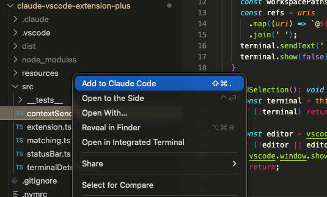
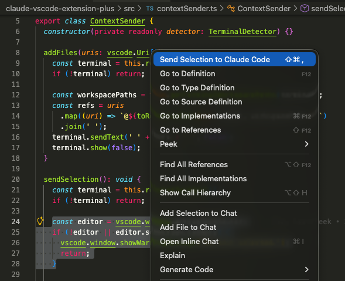
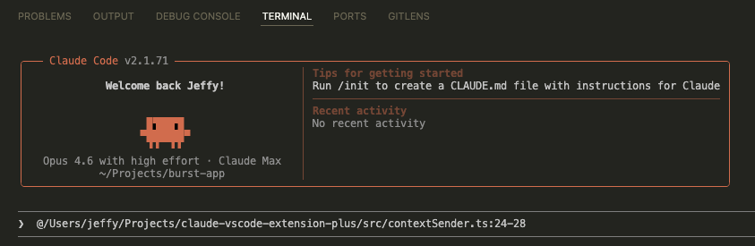

# Autumn Context Bridge

A VS Code extension that bridges your editor and terminal coding agents. It has dedicated Claude Code and Codex actions, plus a shared Agent action for OMP and agents you configure. Right-click files or selections to insert references into the corresponding VS Code integrated terminal, without pressing Enter.

Born out of switching from Cursor to Claude Code — this extension brings back some most-missed editor integrations: right-click to send files and selections as prompt context.

## Features

### Add files to context

Right-click a file in the explorer or editor tab and select **"Add to Claude Code"**. Sends `@path/to/file` to the Claude Code terminal. Supports multi-select.



### Send selections

Select code in the editor, right-click, and choose **"Send Selection to Claude Code"**. Sends `@path/to/file:startLine-endLine` so Claude knows exactly what you're pointing at.



### Result in terminal

References are typed into the Claude Code terminal input without pressing Enter, so you stay in control.



### More features

- **Multi-root workspace support** — Correctly resolves paths in multi-root workspaces. Files in the terminal's folder use relative paths; files in other folders use absolute paths.
- **Auto-detect Claude Code terminals** — Automatically finds terminals named "Claude Code" or matching version patterns (e.g. `1.0.32`). Configurable with custom regex patterns.
- **Manual terminal designation** — Use the command palette to manually designate any terminal as your Claude Code target.
- **Status bar indicator** — Shows when a Claude Code terminal is active. Displays a selection icon when you have text selected, and clicking it sends the selection.

## Keyboard Shortcuts

The existing default shortcuts continue to target Claude Code. Codex commands have no default shortcuts; bind them through VS Code's Keyboard Shortcuts editor if desired.

| Action | Mac | Windows/Linux |
|---|---|---|
| Add current file to context | `Cmd+Shift+.` | `Ctrl+Shift+.` |
| Send selection to context | `Cmd+Shift+,` | `Ctrl+Shift+,` |

## Commands

All commands are available via the command palette (`Cmd+Shift+P`):

- **Add to Claude Code** — Send file(s) as `@`-references
- **Send Selection to Claude Code** — Send selected code with line numbers
- **Set as Claude Code Terminal** — Manually designate a terminal
- **Select Claude Code Terminal** — Choose between multiple Claude Code terminals

### Codex CLI

**Required setup: include the app name in the Codex terminal title.** Before using Codex with this extension, add the following to `~/.codex/config.toml` (or `$CODEX_HOME/config.toml` if you use a custom Codex home):

```toml
[tui]
terminal_title = ["app-name", "spinner", "project"]
```

If `[tui]` already exists, add or update `terminal_title` in that section instead of creating a second `[tui]` section. Restart Codex after editing the file. Alternatively, run `/title` inside Codex, enable **App name**, and save; this updates the title immediately and persists the setting.

This setup is required for this extension's default automatic detection: it matches terminal names containing `codex`, not the running process. Codex's default title uses only `spinner` and `project`, so merely starting `codex` may still result in **No Codex terminal found**. Confirm that the VS Code terminal tab title contains **Codex** before sending a selection. See the official [Codex configuration example](https://learn.chatgpt.com/docs/config-file/config-sample) and [`/title` command documentation](https://learn.chatgpt.com/docs/developer-commands#configure-terminal-title-items-with-title).

Start `codex` in a VS Code integrated terminal. Select code, right-click, and choose **Send Selection to Codex**. For files, choose **Add to Codex** from the explorer (including multiple selected files) or an editor tab. Both Claude and Codex entries are available side by side.

Codex receives plain text references: `src/main.ts` for files, `src/main.ts:10` for a single line, and `src/main.ts:10-20` for a range. Paths containing spaces are quoted, for example `"src/my file.ts":10-20`. These are prompt text, not native file attachments. Claude continues to receive its existing `@`-references.

The command palette also provides:

- **Set as Codex Terminal** — Manually designate any open terminal, including one named `zsh` or `bash`.
- **Select Codex Terminal** — Choose and pin a target from detected or manually designated Codex terminals.

Each CLI has its own status bar item. It appears when a target exists, shows a selection icon when text is selected, and sends the selection on click. Hover over it to see the target terminal's name.

### OMP and additional agents

The existing Claude Code and Codex menu entries remain available. **Add to Agent** and **Send Selection to Agent** open a picker for OMP and any agents in `autumnContextBridge.agents`. The most recently chosen agent appears first. OMP is built in: files use `@src/main.ts`, and selections use `@src/main.ts#L10-20` (or `#L10` for one line). Only references are inserted; selected code is not copied.

OMP paths containing spaces are quoted as `@"src/my file.ts"`; selection ranges follow the closing quote.

OMP terminal titles containing `omp` or `Oh My Pi` are detected automatically. If OMP uses a session title such as `π`, run **Set as Agent Terminal**, choose OMP, then choose the terminal. **Select Agent Terminal** pins one of several detected or designated terminals. Each agent has its own target. The shared status bar item shows the last chosen agent when its target is available; clicking it opens the selection picker.

To add another terminal agent, put an entry in VS Code settings (user or workspace):

```json
{
  "autumnContextBridge.agents": [
    {
      "id": "my-agent",
      "name": "My Agent",
      "terminalNamePatterns": ["^My Agent( |$)"],
      "fileReferenceTemplate": "@{path}",
      "selectionReferenceTemplate": "@{path}:{lineRange}"
    }
  ]
}
```

Terminal patterns are case-insensitive regular expressions. File templates use `{path}`; selection templates can also use `{startLine}`, `{endLine}`, and `{lineRange}`. The latter produces `10` for one line or `10-20` for a range. Agent IDs must be unique lowercase letters, numbers, or hyphens, start with a letter, and cannot be `claude`, `codex`, or `omp`. Invalid entries are reported and skipped. Setting changes take effect without restarting VS Code. If a terminal title does not identify the agent, use **Set as Agent Terminal**.

### Terminal detection and selection

Codex detection matches terminal titles containing `codex`, ignoring case, plus any configured custom patterns. It does not inspect running processes. If the title remains `zsh` or `bash`, manually designate the terminal. Claude's existing title and version-number matching rules are unchanged; Codex does not match bare version numbers.

Claude and Codex maintain independent targets. Sending to Codex never falls back to a Claude terminal just because it has focus. Avoid overly broad custom patterns or manually designating the wrong terminal, since these can match either CLI.

With multiple terminals for the same CLI, the priority is:

1. A manually designated or explicitly selected terminal.
2. The currently active matching terminal.
3. The previously remembered matching terminal, if still open and matching.
4. The first matching terminal in VS Code's terminal list.

Only one terminal receives each insertion. Targets are not selected by the current file's project. A pinned target remains fixed when focus changes; closing it restores automatic selection. Pins last for the current extension session only. If no target exists, the extension prompts you to open or designate one; it does not launch a CLI automatically.

## Configuration

All command IDs and settings use the `autumnContextBridge` prefix. Previous command and setting names are not supported; update any custom keyboard shortcuts and settings to the new IDs. For example, the Codex selection command is `autumnContextBridge.sendSelectionToCodex`.

| Setting | Type | Default | Description |
|---|---|---|---|
| `autumnContextBridge.terminalNamePatterns` | `string[]` | `[]` | Additional regex patterns to match terminal names as Claude Code terminals |
| `autumnContextBridge.codexTerminalNamePatterns` | `string[]` | `[]` | Additional regex patterns to match terminal names as Codex CLI terminals |
| `autumnContextBridge.agents` | `object[]` | `[]` | Additional agents with names, terminal patterns, and reference templates |

Patterns are case-insensitive. Invalid regex patterns are ignored. Changes take effect without restarting VS Code.

## How It Works

The extension inserts references into the chosen terminal input without pressing Enter, so you stay in control. Claude receives `@relative/path` or `@relative/path:startLine-endLine`; Codex receives `relative/path` or `relative/path:startLine-endLine`; OMP receives `@relative/path` or `@relative/path#Lstart-end`.

Paths are resolved relative to the target terminal's working directory: shell integration's directory when available, then the terminal's creation directory, then the first workspace folder. Files outside that directory use absolute paths. If you start a CLI with a different working root (such as `codex -C`), that root may not be visible to VS Code's shell integration.

Selections send the active selection's path and line range, not the code itself. The extension does not save files automatically, so unsaved edits are not included. Use a saved file accessible to the target CLI. Only VS Code integrated terminals are supported; this does not send to the Codex sidebar or desktop app.

<details>
<summary>Development</summary>

```bash
npm install
npm run build        # Build once
npm run launch       # Build and open this local extension in a development window
npm run watch        # Build on save
npm test             # Run tests
```

To test in VS Code, press `F5` to launch the Extension Development Host.

Alternatively, run `npm run launch` (requires the `code` CLI on your PATH). The launcher passes this project's absolute extension path and opens the project in a development window. Test in that new window, not an ordinary VS Code window. Select text in an editor to show the selection context menu, or search for `Send Selection to Codex` in the command palette. You do not need to install the Marketplace version.

### Building & Installing Locally

```bash
npm run package      # Produces autumn-context-bridge-0.1.0.vsix
code --install-extension autumn-context-bridge-0.1.0.vsix
```

</details>

## License

MIT
